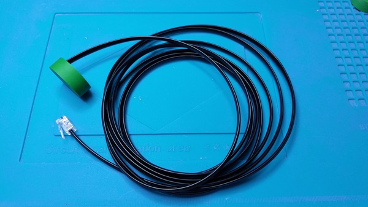
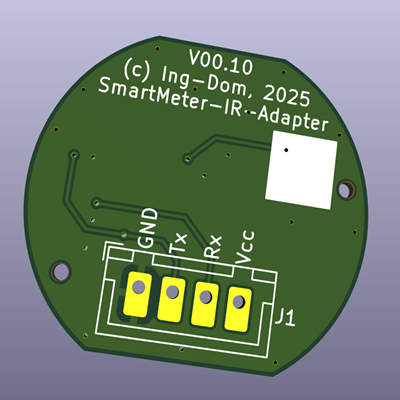
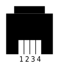
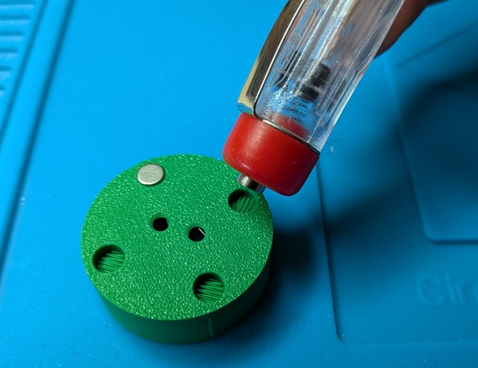
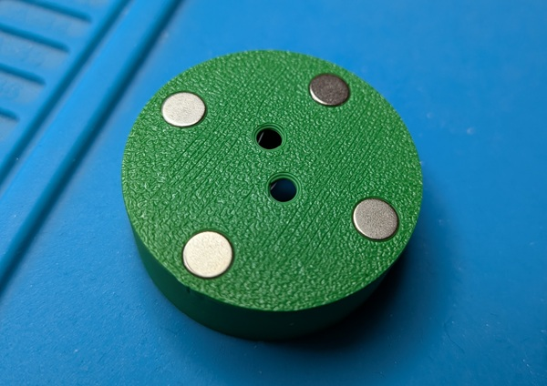
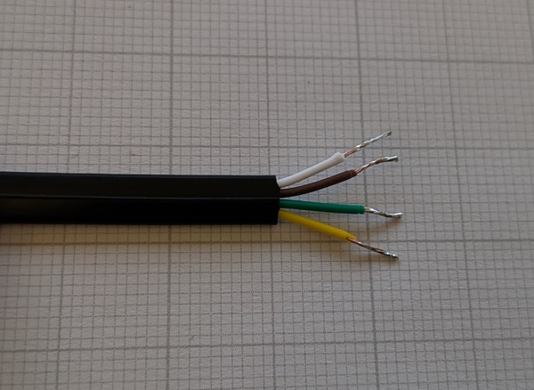
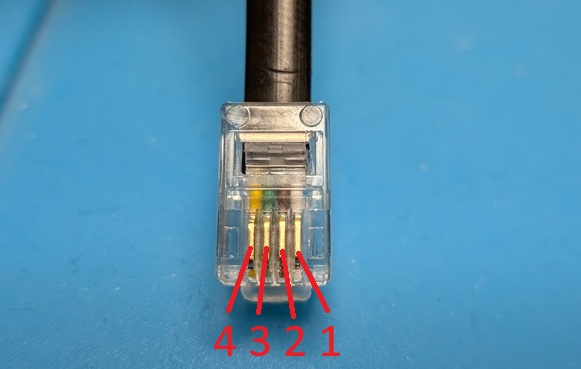
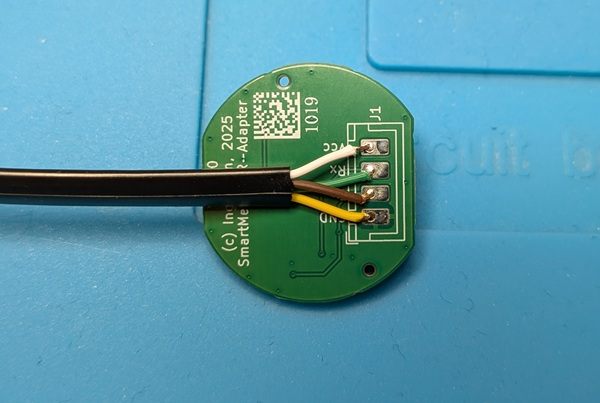
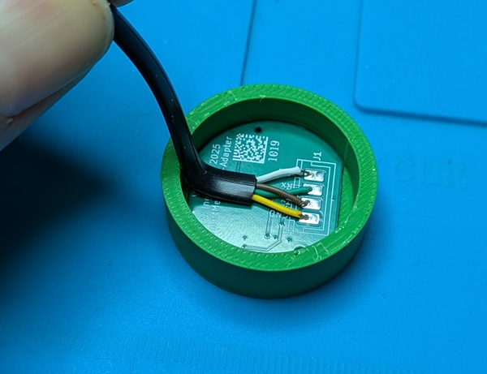
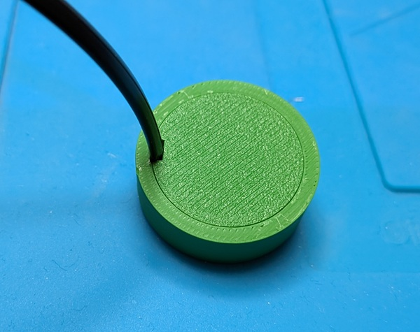

# Smartmeter-IR-Adapter
IR Schreib-Lesekopf für D0 / SML UART / TTL 3.3 - 5V

## Beschreibung der Hardware
Beim Ing-Dom Smartmeter-IR-Adapter handelt es sich um einen bi-direktionalen Umsetzer von Infrarotsignalen auf 3.3V / 5V Logikpegel, vor allem um die sog. D0 oder SML Schnittstelle von Stromzählern (moderne Messeinrichtung) in Deutschland zu nutzen.  

Mit TTL-Pegel UART ist der Adapter dafür gedacht an Mikrocontrollerboards wie Arduino oder Raspberry PiPico aber auch an Raspberry GPIOs abgeschlossen zu werden.  Über UART-USB Adapter kann er auch über USB an diverse Endgeräte angeschlossen werden.
Der Adapter setzt den über UART-Tx (Sendesignal) empfangenen Pegel in ein Leuchten der IR-Sendediode um. Dabei wird invertiert, d.h. wenn UART-Tx HIGH ist, ist die IR-LED aus, ist das Signal LOW, leichtet die IR-LED.  Für den Fall dass die Sendediode vom Gerät nicht angesteuert wird ist ein schwacher PullUp-Transistor (10-50kOhm) vorgesehen, der das elektrische Tx-Signal auf Vcc zieht und damit dir IR-Led definiert ausschaltet.  
Auf der Empfangsseite wird über einen IR-Phototransistor ein von der Gegenstelle empfangene IR-Pulse umgesetzt, auch hier wird invertiert: Im Ruhezustand (kein IR Signal empfangen) wird HIGH ausgegeben, wird ein IR-Signal empfangen, wird UART-Rx LOW angesteuert. 

Das Bild zeigt den aufgebauten Bausatz incl. optionalen RJ22 Anschlusskabel

## Technische Daten

### Elektronische Daten
Vcc: 3.3 - 5V  
Logikpegel: wie Vcc  
max. Baudrate: 9600bit/s

### Elektro-Mechanische Daten

Die Anschlüsse auf dem PCB (Raster 2.54mm) sind beschriftet

Die Anschlüsse sind für das direkte Anlöten eines Anschluskabels oder zur Montage eines JST-XH Steckcers vorgesehen.

Anschlusskabel mit 4poligen Westernstecker 4P4C "RJ9 / RJ10 / RJ22"

Die Belegung kann grundsätzlich beim Aufbau des Bausatzes variiert werden, ist aber für folgende Belegung vorgesehen:

1: Vcc  
2: Tx (Senden zum Zähler)  
3: Rx (Empfangen vom Zähler)  
4: Gnd  

Kontaktnummer des Steckers von vorne, Feder oben  

### Mechanische Daten
Gehäuse: D=32mm, H=10mm  
Magnetische Halterung (Haltekraft abhängig vom Aufbau der Gegenseite)  
Material: PLA  

## Aufbauanleitung
Die Platine wird mit allen notwendigen Bauteilen bestückt geliefert.  
Es muss nur noch ein Anschlusskabel oder Stecker angelötet werden.  
Diese Anleitung bezieht sich auf das im Bausatz mitgelieferte Gehäuse sowie das optional bestellbare Anschlusskabel.

1. Magnete einsetzen
   Die mitgelieferten Rundmagnete müssen ins Gehäude gepresst werden. Auf eine gleiche Orietierung der Magnete sollte geachtet werden.  
   Da es auch Zähler gibt die als "Gegenstelle" für die Magente keine Metallplatte sondern auch Magnete haben, sollte vor dem Einsatz geprüft werden ob die Polarität eine Rolle spielt.  
   Zum Einsetzen empfiehlt sich ein handelsüblicher Phasenprüfer.  
      
      

2. Mantel der Anschlussleitung ca. 2cm abisolieren, Einzeladern auf ca. 12mm kürzen, 5mm abisolieren und die Enden verdrillen und verzinnen
   
     

2. Aderfarben am Stecker ermitteln und mittels der obigen Abbildung zuordnen (Achtung, Aderfarben können wechseln! Abbildung und Auflistung nur beispielhaft!)
   
      1 = weiß = Vcc  
      2 = braun = Tx  
      3 = grün = Rx  
      4 = gelb = GND  
   
        

3. Einzeladern wie abgebildet an die Anschlüsse der Platine löten, Enden kürzen und Platine von Flussmittelresten reinigen
   
        

4. Platine ins Gehäuse einlegen (auf die korrekte Orientierung achten) und das Anschlusskabel mit dem Gehäusedeckel in die entsprechende Aussparung klemmen - dies dient als Zugentlastung.

      
      
      